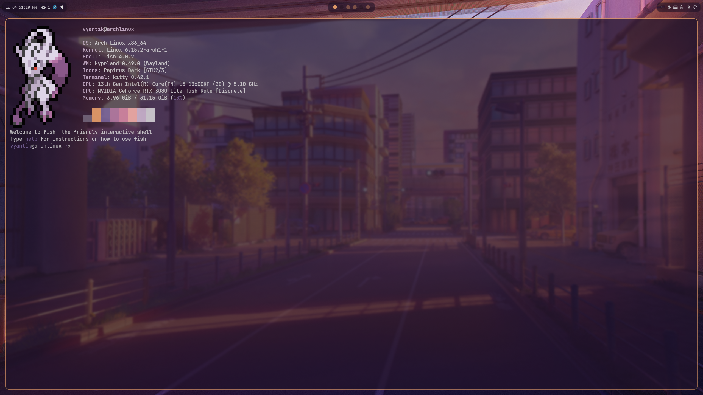

# 🎨 Dotfiles

Мои персональные конфигурационные файлы для Linux системы на базе Arch Linux с Hyprland.

## 🖥️ Система

- **ОС**: Arch Linux
- **Окружение**: Hyprland (Wayland)
- **Терминал**: Kitty
- **Оболочка**: Fish
- **Панель**: Waybar
- **Меню**: Wofi
- **Уведомления**: SwayNC
- **Экран блокировки**: Hyprlock
- **Обои**: Hyprpaper

## 📸 Скриншоты

### Wofi


### Terminal



### SwayNC


## 📁 Структура

```
dotvyantik/
├── fastfetch/          # Конфигурация системной информации
├── fish/              # Конфигурация Fish shell
├── hypr/              # Конфигурация Hyprland
├── kitty/             # Конфигурация терминала Kitty
├── swaync/            # Конфигурация уведомлений
├── waybar/            # Конфигурация панели
└── wofi/              # Конфигурация меню запуска
```

## 🚀 Установка

### Предварительные требования

```bash
# Установка основных пакетов
sudo pacman -S hyprland kitty fish waybar wofi swaync hyprpaper hyprlock fastfetch

# Дополнительные зависимости
sudo pacman -S polkit-gnome pulseaudio-alsa networkmanager
sudo yay -S pokeget
```

### Клонирование и установка

```bash
# Клонирование репозитория
git clone https://github.com/yourusername/dotvyantik.git
cd dotvyantik

# Создание символических ссылок
ln -sf ~/dotvyantik/hypr ~/.config/hypr
ln -sf ~/dotvyantik/kitty ~/.config/kitty
ln -sf ~/dotvyantik/waybar ~/.config/waybar
ln -sf ~/dotvyantik/wofi ~/.config/wofi
ln -sf ~/dotvyantik/swaync ~/.config/swaync
ln -sf ~/dotvyantik/fish ~/.config/fish
ln -sf ~/dotvyantik/fastfetch ~/.config/fastfetch
```

## 🎯 Основные компоненты

### Hyprland

Современный Wayland композитор с поддержкой:

- Плавных анимаций и эффектов
- Динамических рабочих пространств
- Горячих клавиш для управления окнами
- Автоматического запуска приложений

### Waybar

Модульная панель с виджетами:

- Рабочие пространства Hyprland
- Системная информация (CPU, память, батарея)
- Сетевые подключения
- Аудио управление
- Bluetooth статус
- Уведомления и системный лоток

### Kitty

Быстрый терминал с поддержкой:

- Шрифта JetBrains Mono
- Настраиваемых цветовых схем
- GPU ускорения
- Поддержки Unicode

### Fish Shell

Интерактивная оболочка с:

- Автодополнением
- Подсветкой синтаксиса
- Интеграцией с fastfetch
- Поддержкой Bun

### Wofi

Легковесное меню запуска приложений с:

- Настраиваемыми стилями
- Интеграцией с Hyprland
- Быстрым поиском

## 🎨 Темы и стили

### Waybar темы

- **default**: Классическая тема
- **experimental**: Экспериментальная тема
- **line**: Минималистичная линейная тема
- **zen**: Спокойная zen тема

### Цветовые схемы

- Автоматическая генерация цветов на основе обоев
- Поддержка pywal
- Настраиваемые цветовые акценты

## 🔧 Настройка

### Изменение обоев

1. Поместите изображение в `hypr/wallpaper/`
2. Обновите путь в `hypr/hyprpaper.conf`
3. Перезапустите Hyprland

### Настройка мониторов

Отредактируйте `hypr/monitors.conf` для настройки:

- Разрешения экранов
- Частоты обновления
- Позиционирования

### Добавление новых модулей Waybar

1. Создайте модуль в `waybar/modules.json`
2. Добавьте его в основной конфиг `waybar/config.jsonc`

## ⌨️ Горячие клавиши

Основные сочетания клавиш (настраиваются в `hypr/hyprland.conf`):

- `Super + Enter` - Открыть терминал
- `Super + R` - Открыть меню приложений
- `Super + Q` - Закрыть окно
- `Super + 1-9` - Переключение рабочих пространств

## 🐛 Устранение неполадок

### Проблемы с автозапуском

Проверьте файл `hypr/hyprland.conf` в секции `exec-once`

### Проблемы с Waybar

1. Проверьте логи: `journalctl --user -f`
2. Убедитесь, что все модули установлены
3. Проверьте права доступа к скриптам

### Проблемы с Fish

1. Убедитесь, что Fish установлен как оболочка по умолчанию
2. Проверьте переменные окружения в `fish/config.fish`

## 📝 Лицензия

Этот проект распространяется под лицензией MIT. См. файл LICENSE для подробностей.

## 🤝 Вклад в проект

Приветствуются pull request'ы и issue reports! Пожалуйста, убедитесь, что:

1. Код соответствует стилю проекта
2. Добавлены соответствующие комментарии
3. Протестированы изменения

## 📞 Поддержка

Если у вас есть вопросы или проблемы:

1. Создайте issue в репозитории
2. Опишите проблему подробно
3. Приложите логи ошибок

---

**Примечание**: Эти dotfiles настроены для Arch Linux с Hyprland. Для других дистрибутивов может потребоваться дополнительная настройка.
