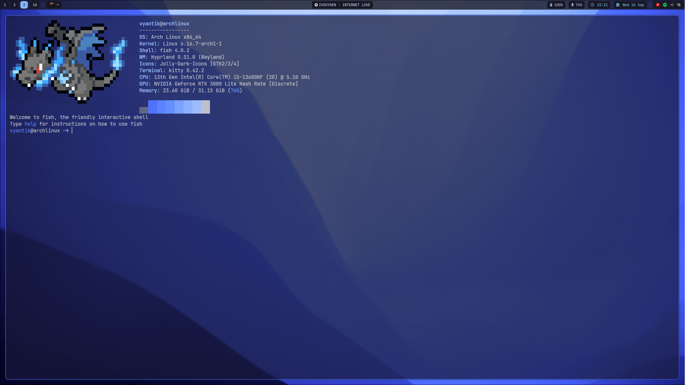
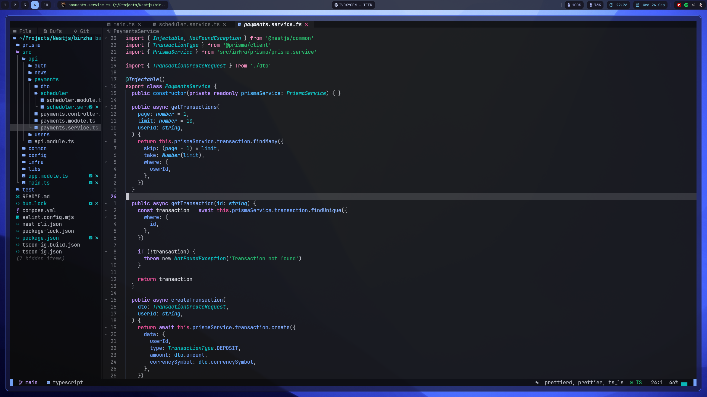

# Dotfiles Installer

Автоматический установщик конфигураций для Arch Linux с интерактивным CLI интерфейсом.

## 📸 Результат установки



*Полностью настроенная система с Hyprland, Waybar, Rofi и другими компонентами*

## 🚀 Особенности

- **Интерактивный CLI** с цветным выводом и меню
- **Модульная установка** - выбирайте только нужные компоненты
- **Автоматическая установка зависимостей** для каждого компонента
- **Резервное копирование** существующих конфигураций
- **Подробный отчет** об успешности установки в виде таблицы
- **Логирование** всех операций для диагностики

## 📦 Компоненты

### 🛠️ Базовые утилиты
- **fd** - быстрый поиск файлов (замена find)
- **ripgrep** - молниеносный поиск по тексту (замена grep)
- **fzf** - интерактивный фильтр для командной строки
- **bat** - улучшенный cat с подсветкой синтаксиса
- **exa** - современная замена ls с Git интеграцией
- **zoxide** - умная навигация по директориям
- **htop, git, curl, wget** и другие essential инструменты

### 🎨 Hyprland WM
- **Hyprland** - современный Wayland композитор
- **Waybar** - настраиваемая панель
- **Rofi** - лаунчер приложений
- **SwayNC** - центр уведомлений
- **Wlogout** - меню выхода
- **Поддержка скриншотов** и буфера обмена

### 🐚 Fish Shell
- **Fish** - дружелюбная командная оболочка
- **Fastfetch** - быстрый системный информер
- **Интеграция с Bun, Go, Rust, Spicetify**
- **Автоматическая настройка PATH**

### 🖥️ Kitty Terminal
- **GPU-ускоренный терминал**
- **Поддержка pywal** для цветовых схем
- **Прозрачность и кастомизация**
- **Ligatures поддержка**

### ✏️ Neovim Editor
- **Конфигурация на базе AstroNvim**
- **LSP серверы** для разных языков программирования
- **Автоматическая установка плагинов**
- **Tree-sitter подсветка синтаксиса**



*Neovim с современным интерфейсом, LSP и плагинами для разработки*

### 📁 Thunar File Manager
- **Легкий файловый менеджер**
- **Поддержка архивов** и медиа-тегов
- **GVFS интеграция** для сетевых дисков
- **Кастомные действия**

### 🗂️ Yazi File Manager
- **Современный файловый менеджер для терминала**
- **Vim-подобные горячие клавиши** для быстрой навигации
- **Превью файлов** (изображения, видео, PDF, код)
- **Интеграция с fd, ripgrep, zoxide, fzf**
- **Полная кастомизация** через TOML конфигурацию

### 🐳 Docker & Docker Compose
- **Платформа контейнеризации** для изолированных приложений
- **Docker Compose** для управления многоконтейнерными приложениями
- **Автоматическая настройка** сервиса и пользовательских групп
- **Готовые примеры** конфигураций в ~/docker-examples
- **Полная интеграция** с системой без sudo

### 🔤 Шрифты и иконы
- **Nerd Fonts** (JetBrains Mono, Fira Code, Hack)
- **Font Awesome** для иконок интерфейса
- **Papirus icon theme**
- **Emoji поддержка**

### 🛠️ CLI утилиты
- **chpaper** - утилита для смены обоев рабочего стола
- **json-parse** - быстрый парсер JSON файлов
- **cursor** - скрипт для запуска Cursor IDE
- **Автоматическое скачивание** Cursor AppImage (v1.6.35)
- **Глобальная установка** в /usr/local/bin

## 🛠️ Установка

### Системные требования
- Arch Linux или производная
- Права sudo
- Подключение к интернету
- Git (устанавливается автоматически)

### Быстрый старт

```bash
# Клонирование репозитория
git clone <your-repo-url> ~/dotfiles
cd ~/dotfiles

# Запуск установщика
./main.sh
```

### Использование

1. **Установить все компоненты** - полная автоматическая установка
2. **Выборочная установка** - выберите только нужные компоненты
3. **Показать статус** - посмотреть что уже установлено
4. **Справка** - подробная информация о каждом компоненте

## 📋 Структура проекта

```
dotfiles/
├── main.sh                 # Основной CLI установщик
├── scripts/                # Скрипты установки компонентов
│   ├── install_base_utils.sh # Базовые утилиты (fd, ripgrep, fzf, etc)
│   ├── install_hypr.sh     # Hyprland и связанные компоненты
│   ├── install_fish.sh     # Fish shell и утилиты
│   ├── install_kitty.sh    # Kitty terminal
│   ├── install_nvim.sh     # Neovim и плагины
│   ├── install_thunar.sh   # Thunar file manager
│   ├── install_yazi.sh     # Yazi file manager
│   ├── install_docker.sh   # Docker & Docker Compose
│   ├── install_fonts.sh    # Шрифты и иконки
│   ├── install_pokemon.sh  # Pokemon для fastfetch
│   └── install_cli_tools.sh # CLI утилиты
├── cli/                    # Пользовательские CLI утилиты
│   ├── chpaper             # Утилита смены обоев
│   ├── cursor              # Скрипт запуска Cursor IDE
│   └── json-parse          # JSON парсер
├── dotfiles/               # Конфигурационные файлы
│   ├── hypr/              # Hyprland конфигурации
│   ├── waybar/            # Waybar конфигурация
│   ├── rofi/              # Rofi темы
│   ├── swaync/            # SwayNC настройки
│   ├── fish/              # Fish shell конфигурация
│   ├── kitty/             # Kitty terminal настройки
│   ├── nvim/              # Neovim конфигурация
│   ├── fastfetch/         # Fastfetch конфигурации
│   ├── Thunar/            # Thunar настройки
│   └── wlogout/           # Wlogout конфигурация
├── pictures/               # Скриншоты для демонстрации
│   ├── example.png         # Общий вид рабочего стола
│   └── nvim_example.png    # Neovim с плагинами
├── README.md              # Документация
└── USAGE.md               # Руководство пользователя
```

## 🔧 Кастомизация

### Мониторы
Отредактируйте `~/.config/hypr/monitors.conf` для настройки ваших мониторов:
```bash
monitor=DP-1,2560x1440@144,0x0,1
monitor=HDMI-A-1,1920x1080@60,2560x0,1
```

### Цветовые схемы
Используйте `pywal` для автоматической генерации цветовых схем:
```bash
wal -i ~/Pictures/wallpaper.jpg
```

### Waybar модули
Кастомизируйте панель в `~/.config/waybar/config.jsonc`

### Yazi конфигурация
Настройте файловый менеджер в `~/.config/yazi/yazi.toml`:
```toml
[manager]
show_hidden = true
sort_by = "modified"
sort_reverse = true
```

### Docker использование
После установки Docker доступны готовые примеры:
```bash
cd ~/docker-examples
docker-compose up -d    # запуск nginx + redis
docker-compose down     # остановка сервисов
```

## 🐛 Диагностика

### Логи установки
Логи сохраняются в `/tmp/install_*.log` для каждого компонента.

### Проверка статуса
```bash
./main.sh
# Выберите опцию 3 для просмотра статуса
```


### Частые проблемы

1. **Ошибки прав доступа**: Убедитесь, что у вас есть sudo права
2. **Сетевые ошибки**: Проверьте подключение к интернету
3. **AUR пакеты**: Установите `yay` или `paru` для доступа к AUR
4. **Конфликты пакетов**: Удалите конфликтующие пакеты вручную

## 📝 Лицензия

Этот проект распространяется под лицензией MIT. Смотрите файл LICENSE для подробностей.

## 🖼️ Галерея

### Полный рабочий стол


**Что показано:**
- Hyprland композитор с прозрачностью
- Waybar с модулями (время, звук, workspaces)
- Kitty terminal с Nerd Fonts
- Fish shell с fastfetch
- Кастомные обои и цветовая схема

### Neovim в действии


**Возможности:**
- AstroNvim конфигурация
- LSP интеграция для автодополнения
- Tree-sitter подсветка синтаксиса
- Файловый браузер и Git интеграция
- Современная тема с иконками

## 🤝 Вклад в проект

Если вы хотите внести свой вклад:

1. Форкните репозиторий
2. Создайте ветку для новой функции
3. Внесите изменения
4. Создайте Pull Request

## 📞 Поддержка

Если у вас возникли проблемы или вопросы:
- Создайте Issue в репозитории

---

**Автор**: vyantik  
**Версия**: 1.0.0  
**Дата**: 2025
